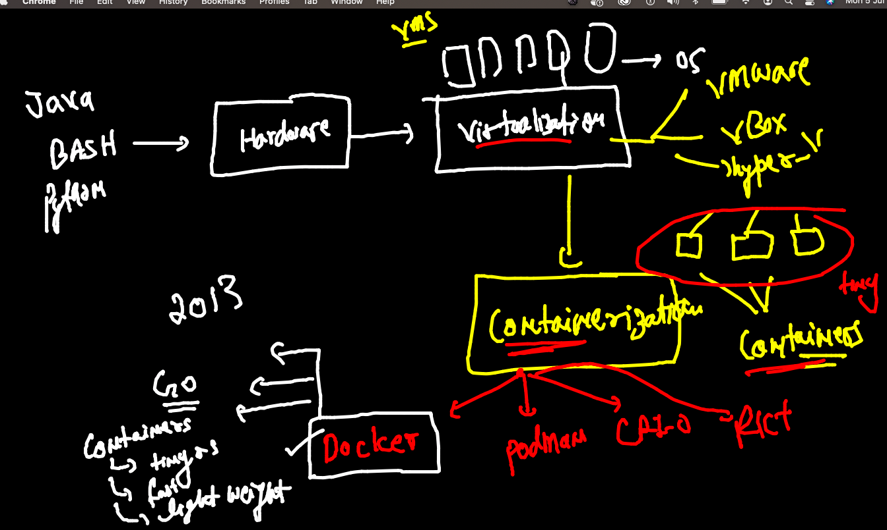
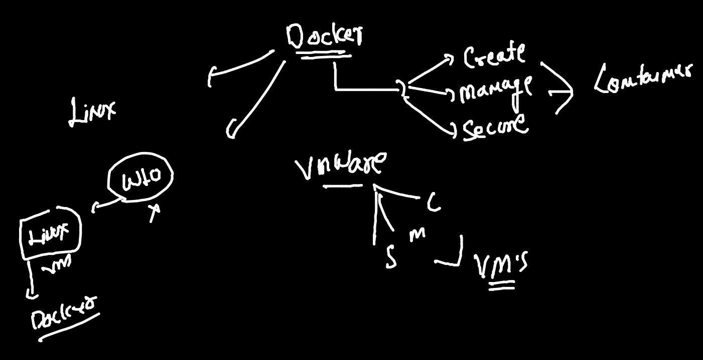
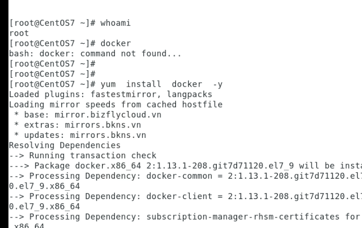
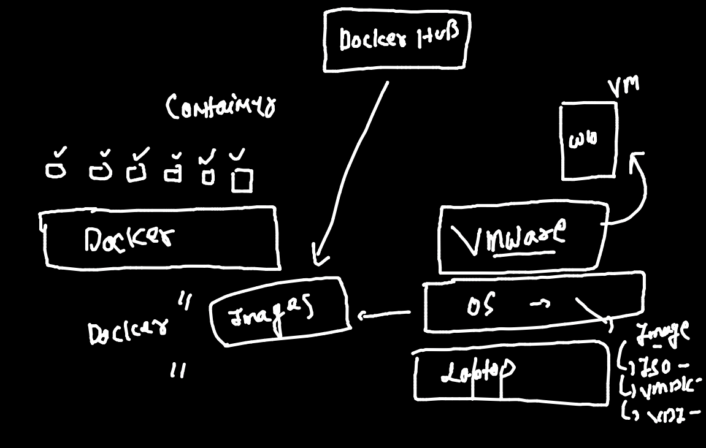
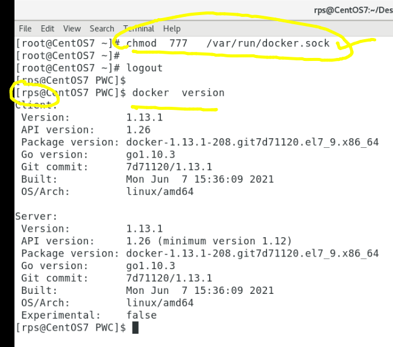
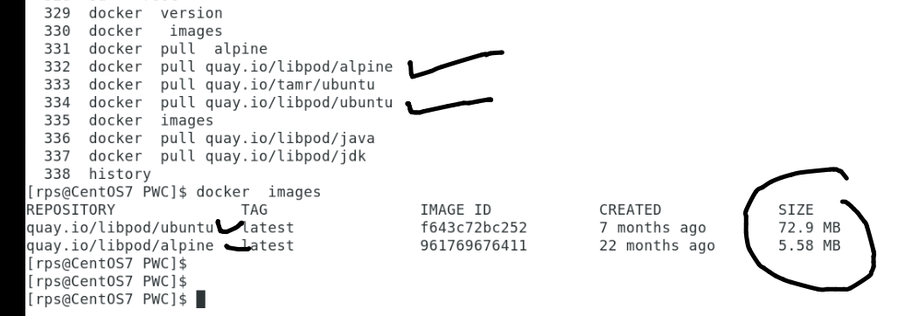
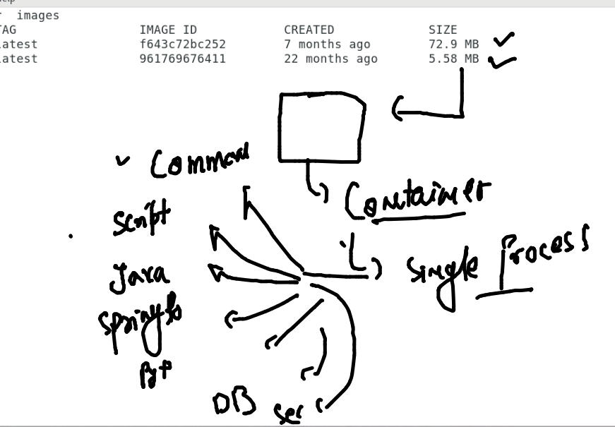

## Docker & containers 

## More about Docker 

## Installing docker in Centos 7

## starting docker service in centos 

## Docker images we can download from Docker hub 

## giving non root user access for docker 

## DOcker Pull image from Quay

## parent process in the container 

## Docker container creation

