# OS info 

## Kernel Info 

## linux flavours 

## windows vs linux FS 

## Basic commands 

## FOr loop to create directory 

## Getting started with SHELL

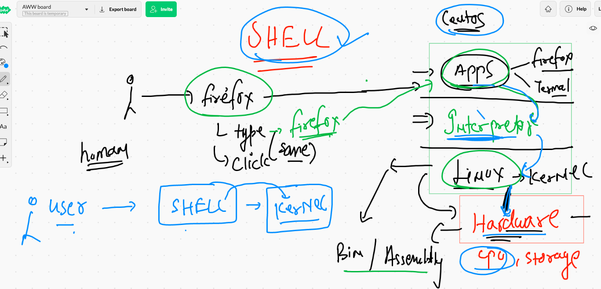

## list of shells 

## command storage location 

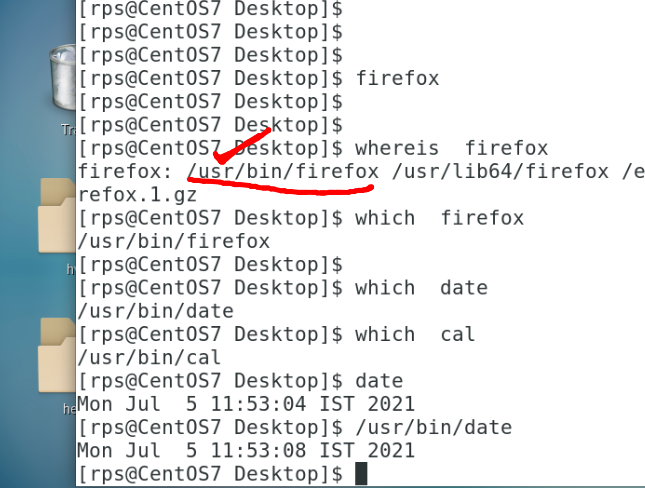

## list of supported shell In centos 

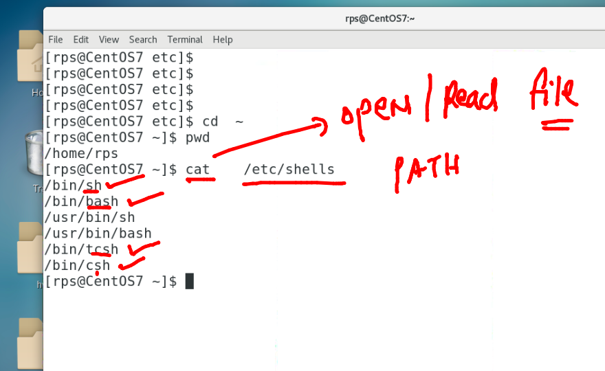

## SHELL working 

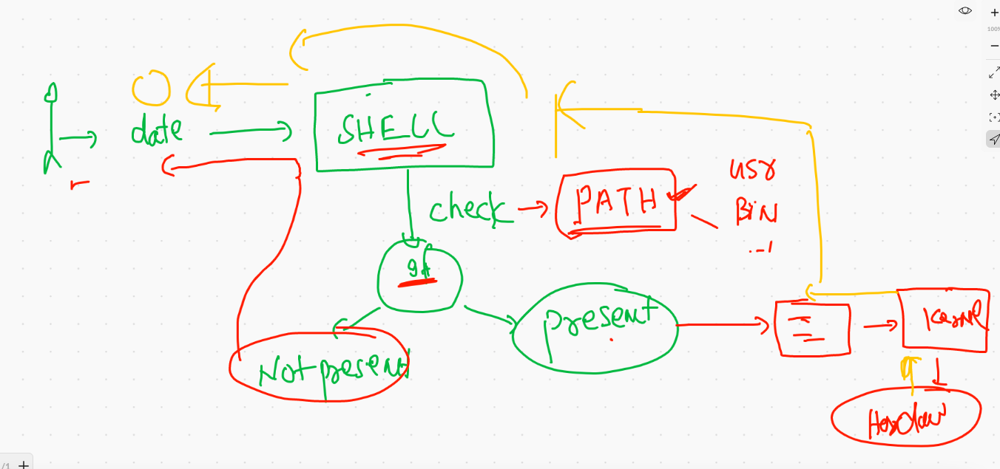

## getting started with SHELL scripting 

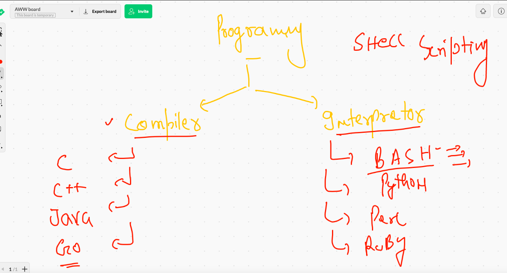

## Method of running shell scripts 

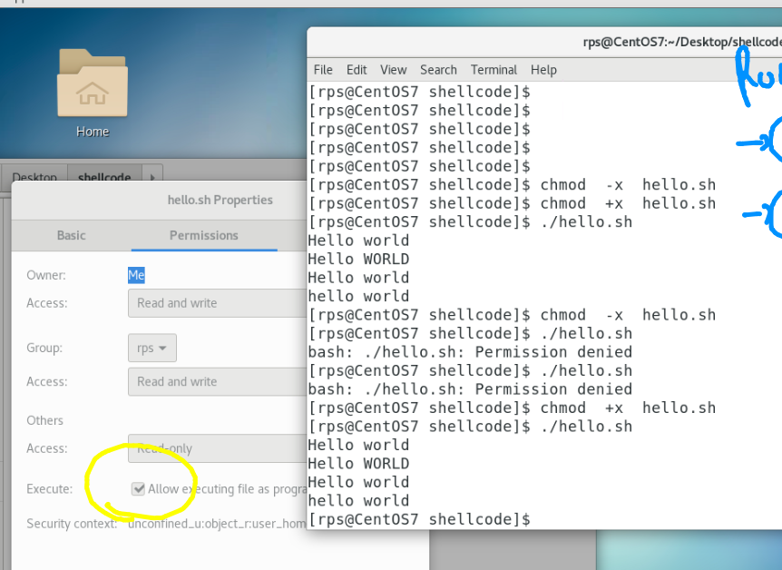

### final run methods 

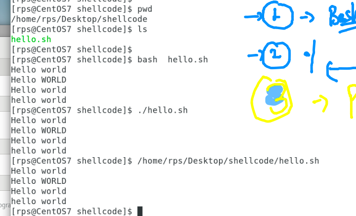

## command inside linux shells 

## conditional statements 

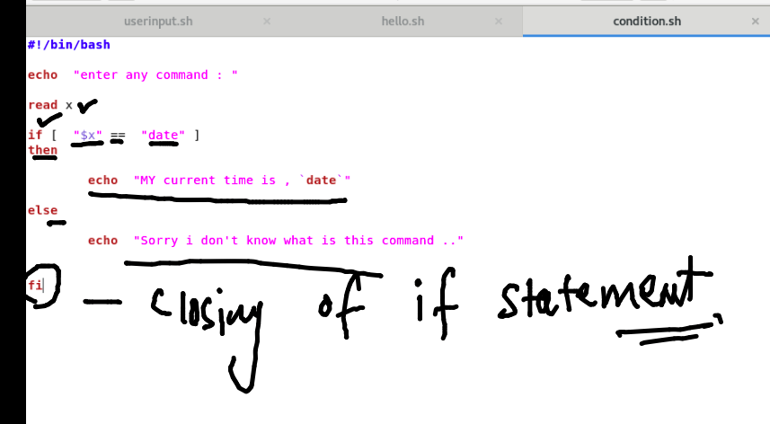

## Example of conditional statement 

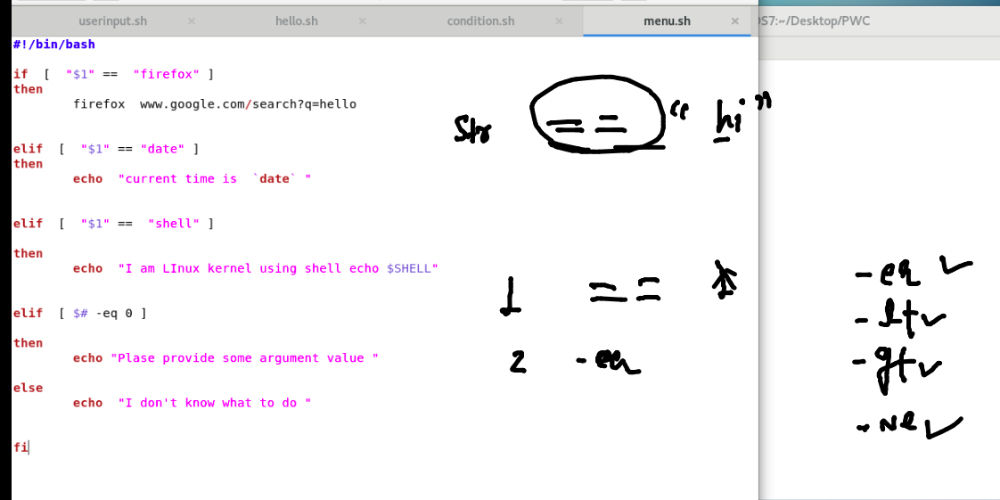

### running above code 

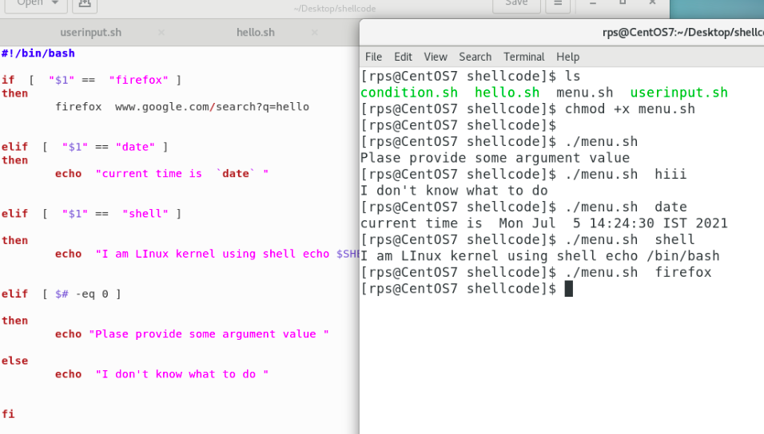

# Intro to For loop 

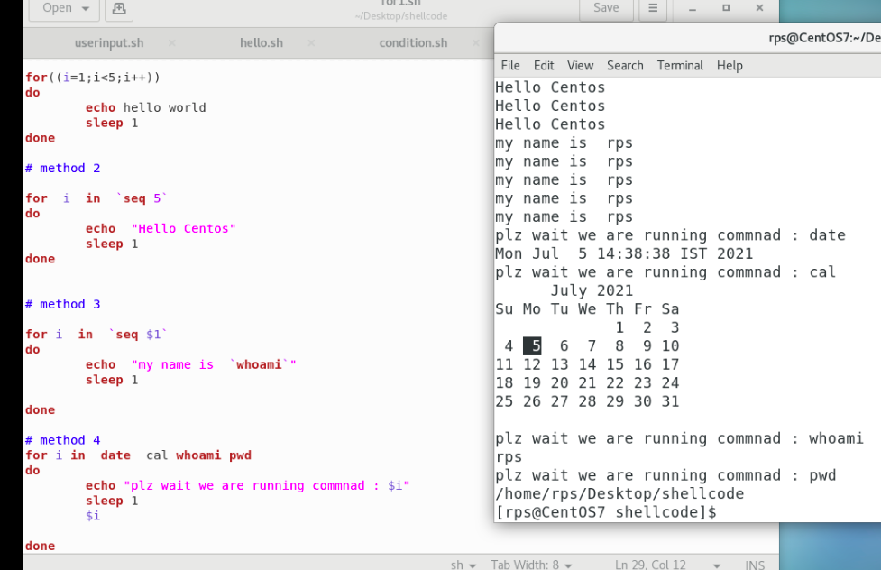

## final shell script 

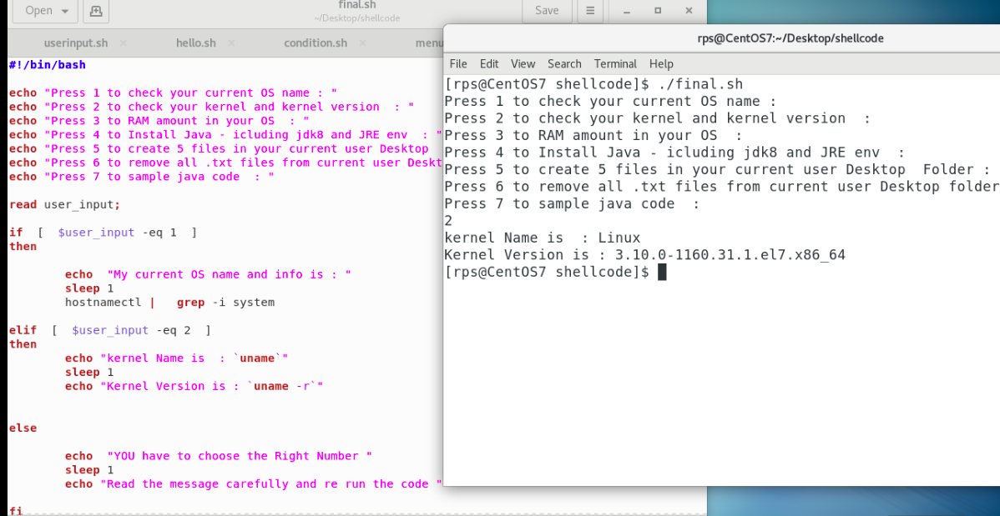

## Software installer inOS

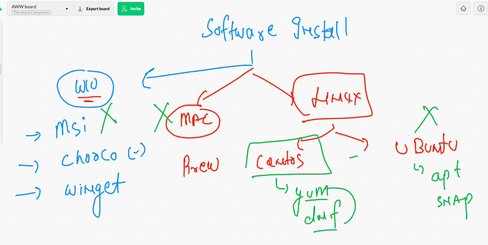

## root access 

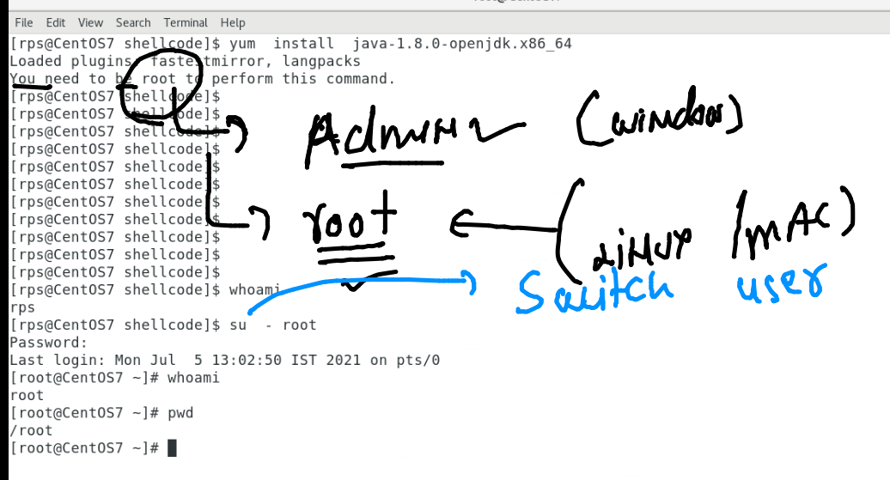

### JDK install on centos 

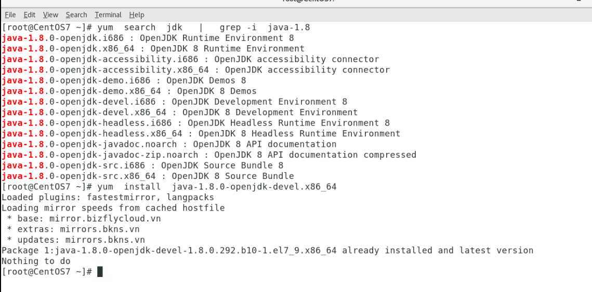

