# PWC

## day 1 revision 

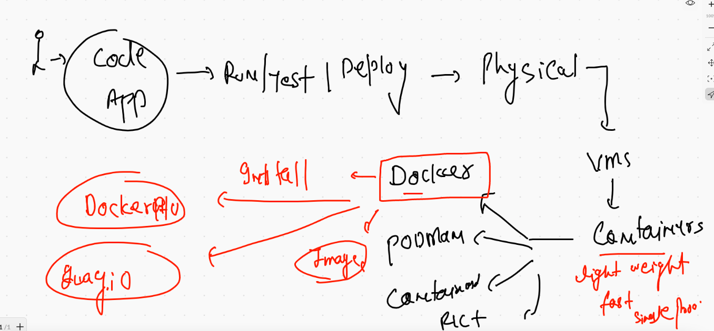

## vim info 

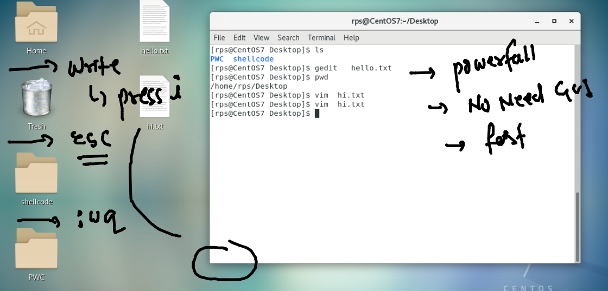

## creating container 

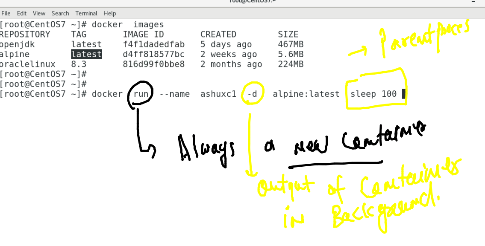

## starting container 

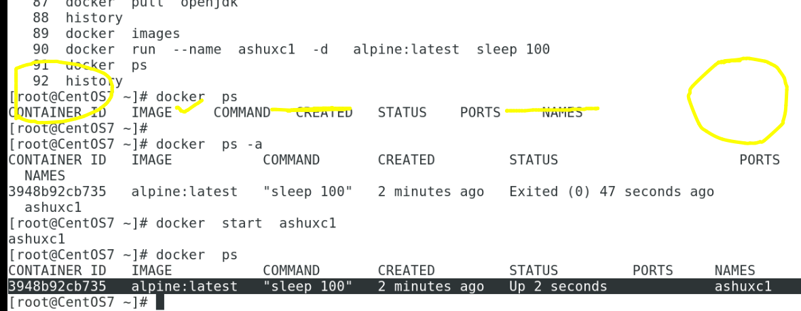

## FROM app to COntinaer journey 

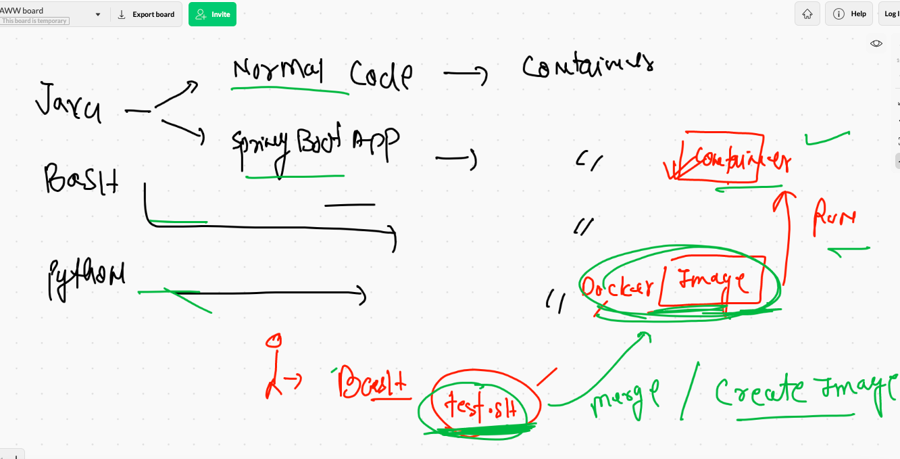

## APP build and RUN 

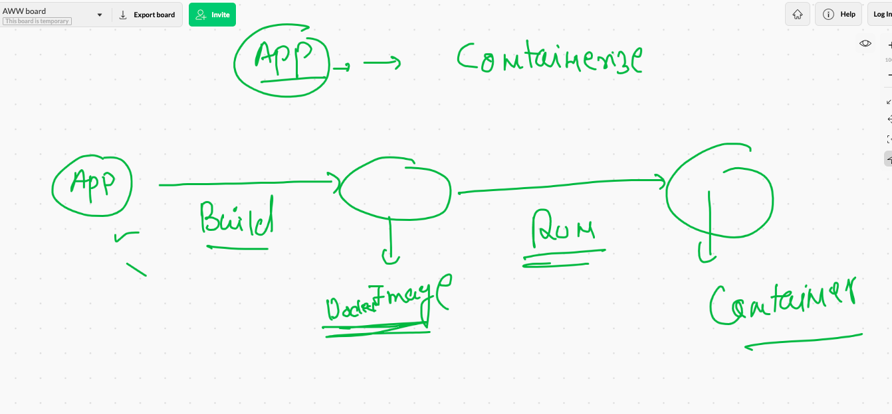

### BUIld toops 

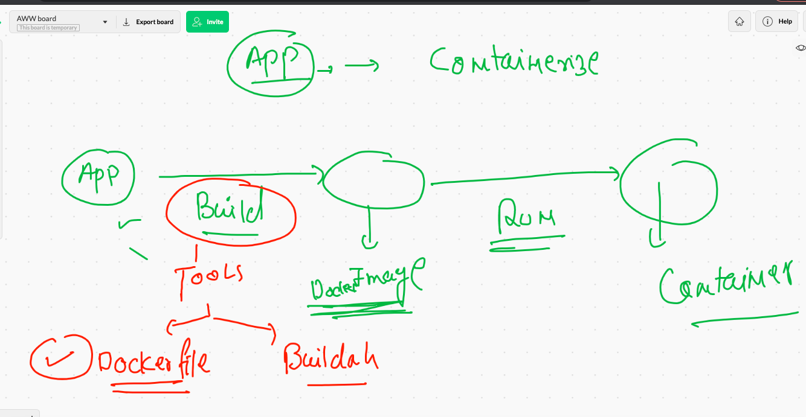

## TO run any code what we need 

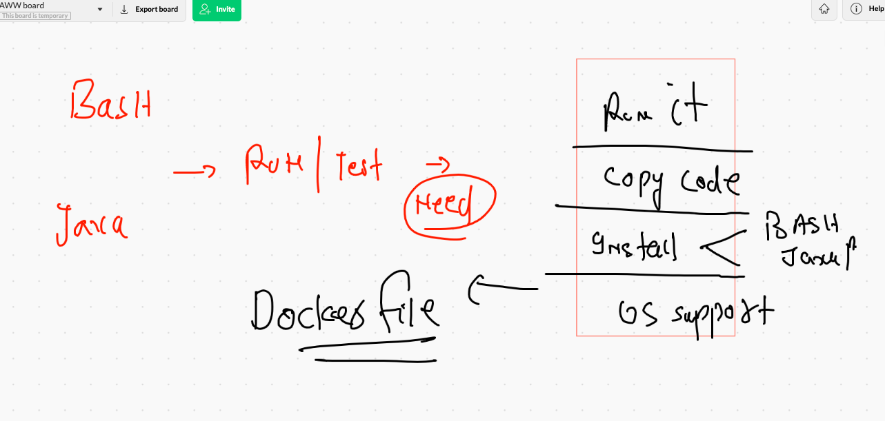

## Docker building of images 

### image build 

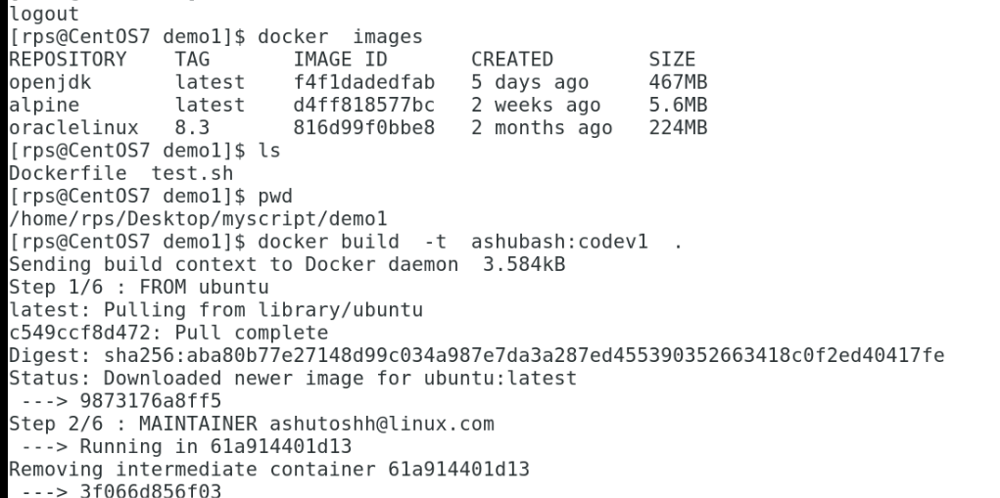

## use of CMD instruction in Dockerfile 

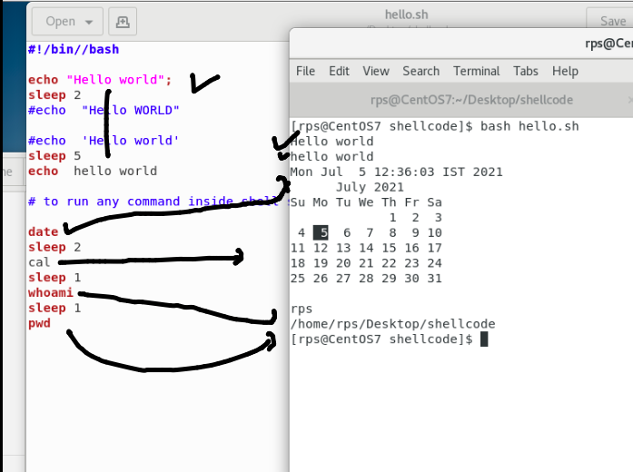

## creating and checking container

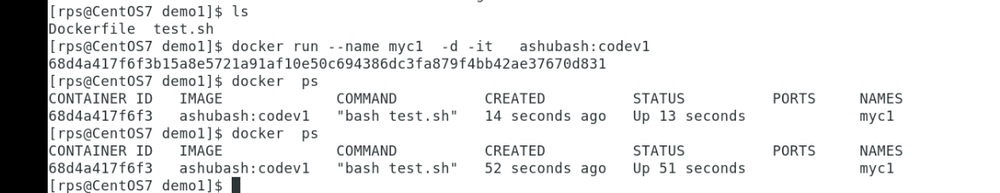

### login into a running container 

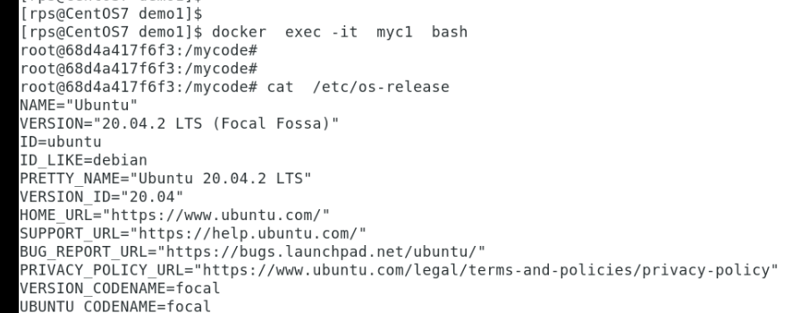

### building docker image for  sample java code

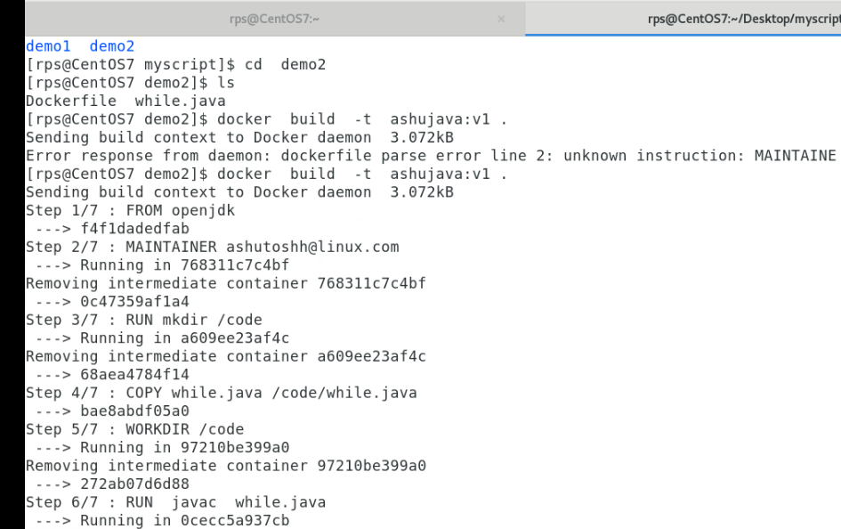

## creating java container 

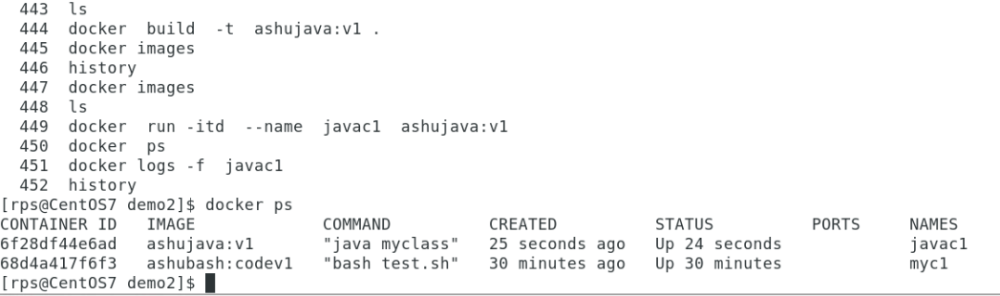

## Dockerfile with custom jdk version 

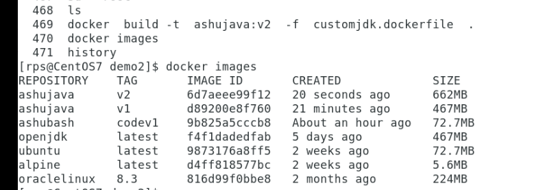

## Dnf search with temporary container 

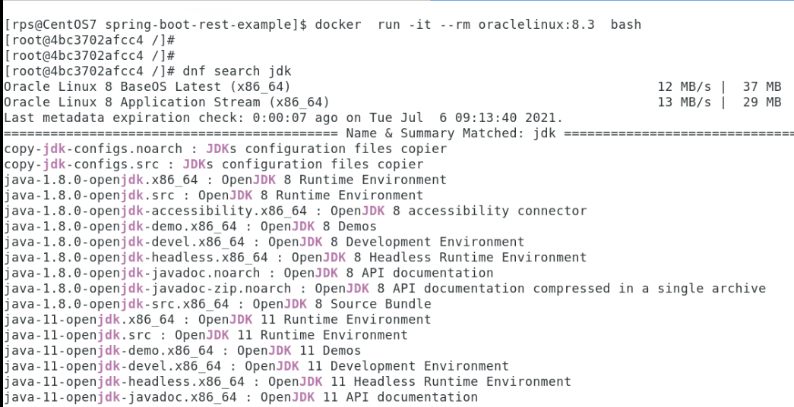

## java sample spring boot app build 

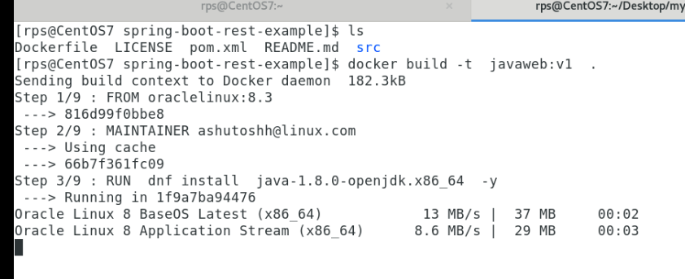

