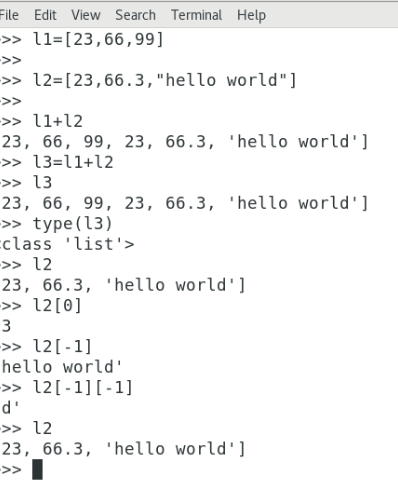
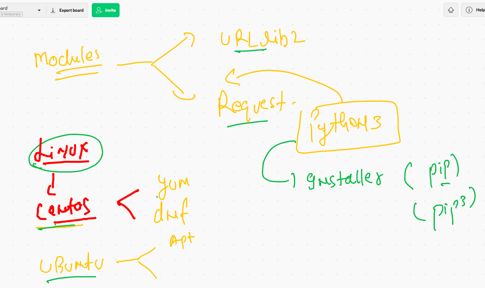
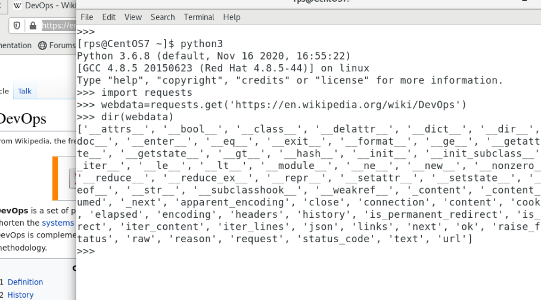

# PWC

## getting started with Python 

## Python 3 domains 

## RUnning python code methods

### Method 1 

### method 2

### Method 3 

### Method 4 

# variables in python3

## basic Ops 

## data types in python 

# String operations in Python 

## Dir function in python 

## Indexing in python 

### string range

# Getting started with Tuple 

## Tuple 

## Indexing concept in python 

# List in Python -- the mutable data type 

## opertaions in list 

## Indentation in python 

# Task1 

## revision 

## Introduing time module 

### subprocess module 

# COntainerization of python code 

## creating container 

### code testing in container 

### functions in python 

### Modules reality in Python 3

### default module location 

## For in Python 

### Python module installer 

### install module only for current user

## Accessing data from URL 

## reading csv from URL 

## AUtomation hit and try using python just idea

## Devops -- 

## Devops automation tool 

