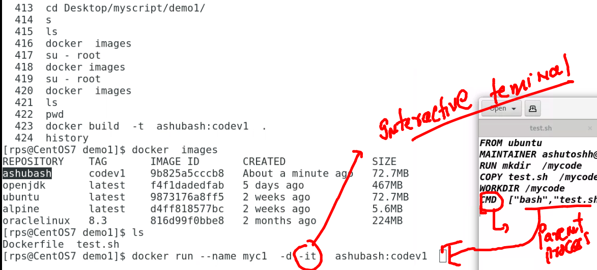

# PWC

## day 1 revision 

## vim info 

## creating container 

## starting container 

## FROM app to COntinaer journey 

## APP build and RUN 

### BUIld toops 

## TO run any code what we need 

## Docker building of images 

### image build 

## use of CMD instruction in Dockerfile 

## creating and checking container

### login into a running container 

### building docker image for  sample java code

## creating java container 

## Dockerfile with custom jdk version 

## Dnf search with temporary container 

## java sample spring boot app build 

