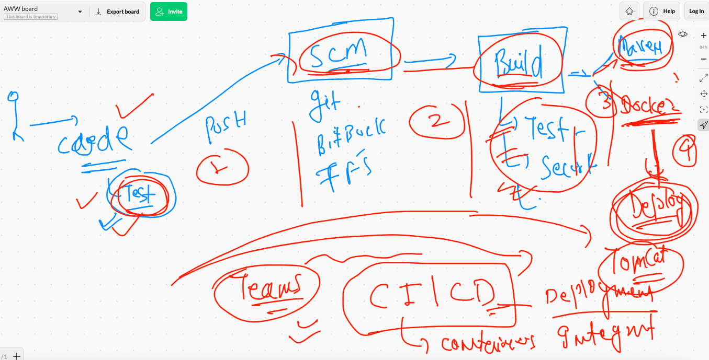

# PWC

## Devops need 


## devops info 


## automation tools


## View of automation -- CI | CD



## Installing  ANsible 


## Installing jenkins 

```
wget -O /etc/yum.repos.d/jenkins.repo     https://pkg.jenkins.io/redhat-stable/jenkins.repo
rpm --import https://pkg.jenkins.io/redhat-stable/jenkins.io.key
 
 yum install jenkins java-11-openjdk-devel
 
systemctl daemon-reload 
systemctl  start  jenkins 
 systemctl  enable  jenkins 
jenkins.service is not a native service, redirecting to /sbin/chkconfig.
Executing /sbin/chkconfig jenkins on

```


