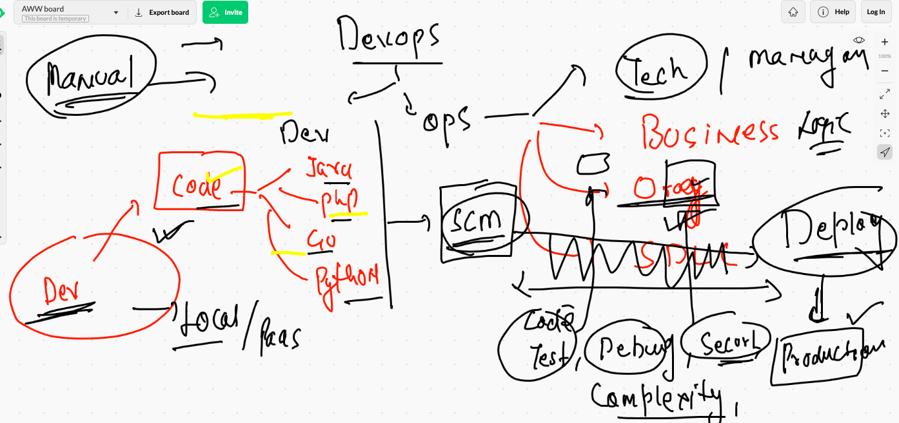
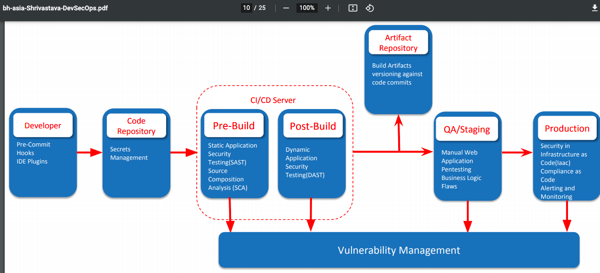
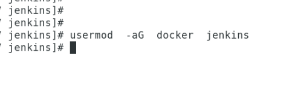
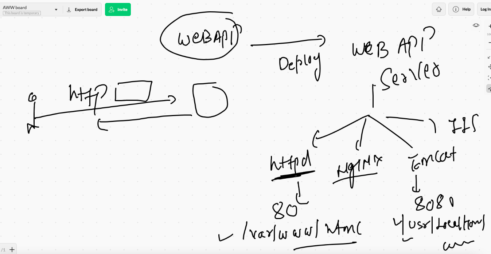
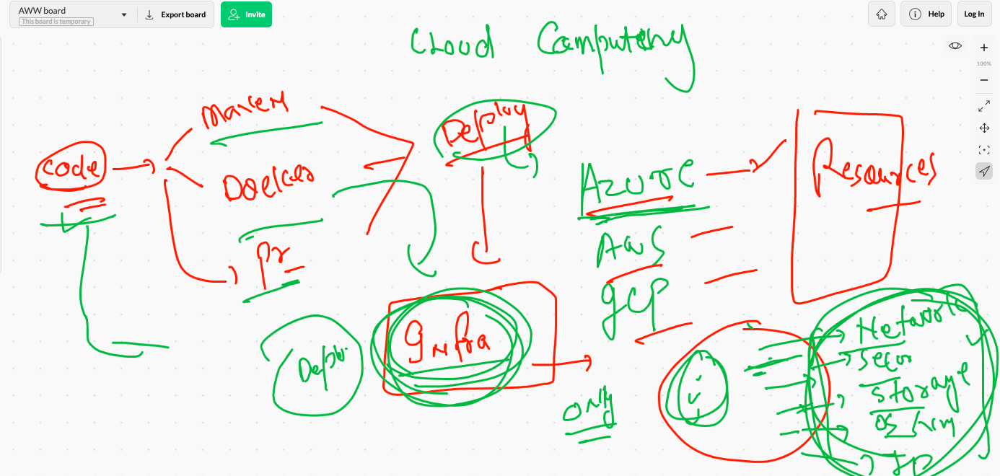

# PWC

## Devops days 



## Devops process


## Devops culture pipeline 


## Devops pipeline clear picture 



## Few glimpse of Devops track 


## Ansible a look 


## Sample Demo playbook of ansible


## creating jenkins job 


## Jenkins to docker connection 

### Note if getting unable to connect permission denied then 



## various web application servers



## IAC  --pre 



## Terraform Offering 


## Azure cloud Resource group 


## Terraform providers


### Terraform providers with HCL 


## Terraform first script 


## Terraform commands 


### terraform plan 

```
ashutoshh@Azure:~/pwctf$ terraform  plan

Terraform used the selected providers to generate the following execution plan. Resource actions are indicated with the following symbols:
  + create

Terraform will perform the following actions:

  # azurerm_resource_group.pwcrg will be created
  + resource "azurerm_resource_group" "pwcrg" {
      + id       = (known after apply)
      + location = "eastus"
      + name     = "ashupwcrg"
    }

Plan: 1 to add, 0 to change, 0 to destroy.

─────────────────────────────────────────────────────────────────────────────────────────────────────────────────────────────────────────────

Note: You didn't use the -out option to save this plan, so Terraform can't guarantee to take exactly these actions if you run "terraform
apply" now.

```

### terraform apply 

```
ashutoshh@Azure:~/pwctf$ terraform  apply

Terraform used the selected providers to generate the following execution plan. Resource actions are indicated with the following symbols:
  + create

Terraform will perform the following actions:

  # azurerm_resource_group.pwcrg will be created
  + resource "azurerm_resource_group" "pwcrg" {
      + id       = (known after apply)
      + location = "eastus"
      + name     = "ashupwcrg"
    }

Plan: 1 to add, 0 to change, 0 to destroy.

Do you want to perform these actions?
  Terraform will perform the actions described above.
  Only 'yes' will be accepted to approve.

  Enter a value: yes

azurerm_resource_group.pwcrg: Creating...
azurerm_resource_group.pwcrg: Creation complete after 2s [id=/subscriptions/e9e1ae1d-57c2-49ce-b86c-06b7511c9845/resourceGroups/ashupwcrg]

Apply complete! Resources: 1 added, 0 changed, 0 destroyed.

```

## taking code from docs


